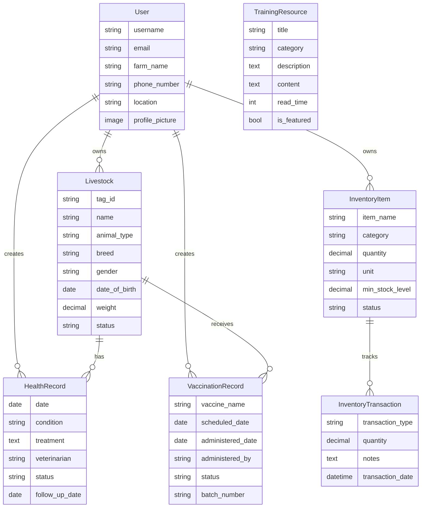

# 🐄 AgricTrack Backend

**A comprehensive livestock management system built for farmers in Botswana.**

AgricTrack is a REST API backend that helps farmers manage their livestock, track animal health, maintain inventory, and access educational resources — all from a single platform.

---

## 📋 Table of Contents

- [Features](#-features)
- [Tech Stack](#-tech-stack)
- [Project Structure](#-project-structure)
- [Getting Started](#-getting-started)
  - [Prerequisites](#prerequisites)
  - [Installation](#installation)
  - [Running the Server](#running-the-server)
- [API Documentation](#-api-documentation)
  - [Authentication](#authentication)
  - [Livestock Management](#livestock-management)
  - [Health & Vaccination](#health--vaccination)
  - [Inventory Management](#inventory-management)
  - [Reports](#reports)
  - [Training Resources](#training-resources)
- [Database Schema](#-database-schema)
- [License](#-license)

---

## ✨ Features

- **🔐 User Authentication** — JWT-based registration and login with custom farmer profiles (farm name, phone number, location)
- **🐮 Livestock Management** — Register, track, and manage individual animals (cattle, goats, sheep, poultry) with tag IDs, breed info, weight, and status tracking
- **🏥 Health Records** — Log health conditions, treatments, veterinarian visits, and follow-up dates per animal
- **💉 Vaccination Tracking** — Schedule and track vaccinations for individual animals or groups, with batch number recording and status management
- **📦 Inventory Management** — Track farm supplies (feed, medicine, equipment) with automatic low-stock alerts and transaction history
- **📊 Reports & Analytics** — Generate livestock summary and health reports with date filtering, breakdowns by type/status, and aggregate statistics
- **📚 Training Resources** — Browse educational articles on animal health, farm management, nutrition, market info, and government programs

---

## 🛠 Tech Stack

| Technology | Version | Purpose |
|---|---|---|
| **Python** | 3.10+ | Runtime |
| **Django** | 6.0 | Web framework |
| **Django Ninja** | 1.1+ | REST API framework |
| **PyJWT** | 2.8+ | JWT authentication |
| **Pillow** | 10.0+ | Image processing (profile pictures, training images) |
| **django-cors-headers** | 4.3+ | Cross-Origin Resource Sharing |
| **SQLite** | — | Default database (development) |
| **psycopg2-binary** | 2.9+ | PostgreSQL adapter (production) |

---

## 📁 Project Structure

```
agrictrack_backend/
├── agrictrack_backend/       # Project configuration
│   ├── settings.py           # Django settings
│   ├── urls.py               # Root URL configuration
│   ├── api.py                # API router registration
│   ├── wsgi.py               # WSGI entry point
│   └── asgi.py               # ASGI entry point
│
├── accounts/                 # User authentication & profiles
│   ├── models.py             # Custom User model (farm_name, phone, location)
│   ├── api.py                # Register, login, profile endpoints
│   └── schemas.py            # Request/response schemas
│
├── livestock/                # Livestock management
│   ├── models.py             # Livestock model (tag_id, breed, weight, status)
│   ├── api.py                # CRUD endpoints for animals
│   └── schemas.py            # Livestock schemas
│
├── health/                   # Health & vaccination records
│   ├── models.py             # HealthRecord, VaccinationRecord models
│   ├── api.py                # Health & vaccination endpoints
│   └── schemas.py            # Health schemas
│
├── inventory/                # Farm inventory management
│   ├── models.py             # InventoryItem, InventoryTransaction models
│   ├── api.py                # Inventory CRUD & transaction endpoints
│   └── schemas.py            # Inventory schemas
│
├── reports/                  # Analytics & reporting
│   └── api.py                # Livestock summary & health report endpoints
│
├── training/                 # Educational resources
│   ├── models.py             # TrainingResource model
│   ├── api.py                # Training resource endpoints
│   └── schemas.py            # Training schemas
│
├── media/                    # Uploaded files (profile pics, training images)
├── manage.py                 # Django management script
├── requirements.txt          # Python dependencies
└── db.sqlite3                # SQLite database (development)
```

---

## 🚀 Getting Started

### Prerequisites

- **Python 3.10+** installed on your system
- **pip** (Python package manager)
- **Git** (for cloning the repository)

### Installation

1. **Clone the repository**

   ```bash
   git clone <repository-url>
   cd agrictrack_backend
   ```

2. **Create a virtual environment**

   ```bash
   python -m venv .venv
   ```

3. **Activate the virtual environment**

   - **Windows:**
     ```bash
     .venv\Scripts\activate
     ```
   - **macOS/Linux:**
     ```bash
     source .venv/bin/activate
     ```

4. **Install dependencies**

   ```bash
   pip install -r requirements.txt
   ```

5. **Run database migrations**

   ```bash
   python manage.py migrate
   ```

6. **Create a superuser** (for admin access)

   ```bash
   python manage.py createsuperuser
   ```

### Running the Server

```bash
python manage.py runserver
```

The API will be available at `http://127.0.0.1:8000/api/`

The interactive API docs (Swagger UI) are available at `http://127.0.0.1:8000/api/docs`

---

## 📖 API Documentation

All API endpoints are prefixed with `/api/`. Authentication is required for most endpoints using a **Bearer token** in the `Authorization` header.

### Authentication

| Method | Endpoint | Description |
|---|---|---|
| `POST` | `/api/auth/register` | Register a new farmer account |
| `POST` | `/api/auth/login` | Login and receive JWT token |
| `GET` | `/api/auth/me` | Get current user profile 🔒 |

**Register Request Example:**

```json
{
  "full_name": "John Doe",
  "email": "john@example.com",
  "password": "securepassword",
  "farm_name": "Doe's Farm",
  "phone_number": "+267 7123 4567",
  "location": "Gaborone"
}
```

**Using the token:** Include the JWT token in the `Authorization` header:

```
Authorization: Bearer <your-jwt-token>
```

---

### Livestock Management

| Method | Endpoint | Description |
|---|---|---|
| `GET` | `/api/livestock/` | List all livestock 🔒 |
| `POST` | `/api/livestock/` | Add a new animal 🔒 |
| `GET` | `/api/livestock/{id}` | Get animal details 🔒 |
| `PUT` | `/api/livestock/{id}` | Update animal info 🔒 |
| `DELETE` | `/api/livestock/{id}` | Remove an animal 🔒 |

**Supported Animal Types:** `cattle`, `goat`, `sheep`, `poultry`

**Status Options:** `healthy`, `sick`, `pregnant`, `quarantine`

---

### Health & Vaccination

| Method | Endpoint | Description |
|---|---|---|
| `GET` | `/api/health/records` | List health records 🔒 |
| `POST` | `/api/health/records` | Create a health record 🔒 |
| `GET` | `/api/health/records/{id}` | Get health record details 🔒 |
| `PUT` | `/api/health/records/{id}` | Update a health record 🔒 |
| `DELETE` | `/api/health/records/{id}` | Delete a health record 🔒 |
| `GET` | `/api/health/vaccinations` | List vaccination records 🔒 |
| `POST` | `/api/health/vaccinations` | Schedule a vaccination 🔒 |
| `GET` | `/api/health/vaccinations/{id}` | Get vaccination details 🔒 |
| `PUT` | `/api/health/vaccinations/{id}` | Update vaccination record 🔒 |
| `DELETE` | `/api/health/vaccinations/{id}` | Delete vaccination record 🔒 |

---

### Inventory Management

| Method | Endpoint | Description |
|---|---|---|
| `GET` | `/api/inventory/` | List inventory items 🔒 |
| `POST` | `/api/inventory/` | Add inventory item 🔒 |
| `GET` | `/api/inventory/{id}` | Get item details 🔒 |
| `PUT` | `/api/inventory/{id}` | Update item 🔒 |
| `DELETE` | `/api/inventory/{id}` | Delete item 🔒 |

**Categories:** `feed`, `medicine`, `equipment`, `other`

**Auto-status:** Stock status is automatically calculated based on quantity vs. minimum stock level.

---

### Reports

| Method | Endpoint | Description |
|---|---|---|
| `GET` | `/api/reports/livestock-summary` | Livestock summary report 🔒 |
| `GET` | `/api/reports/health-report` | Health & vaccination report 🔒 |

**Query Parameters:** `from_date` and `to_date` (format: `YYYY-MM-DD`) for date range filtering.

---

### Training Resources

| Method | Endpoint | Description |
|---|---|---|
| `GET` | `/api/training/` | List training resources 🔒 |
| `GET` | `/api/training/{id}` | Get resource details 🔒 |

**Categories:** `animal_health`, `farm_management`, `market_info`, `nutrition`, `government_programs`

---

## 🗄 Database Schema



---

## 📝 License

This project was developed as a school project for livestock management in Botswana.

---

> 🔒 = Requires authentication (JWT Bearer token)
